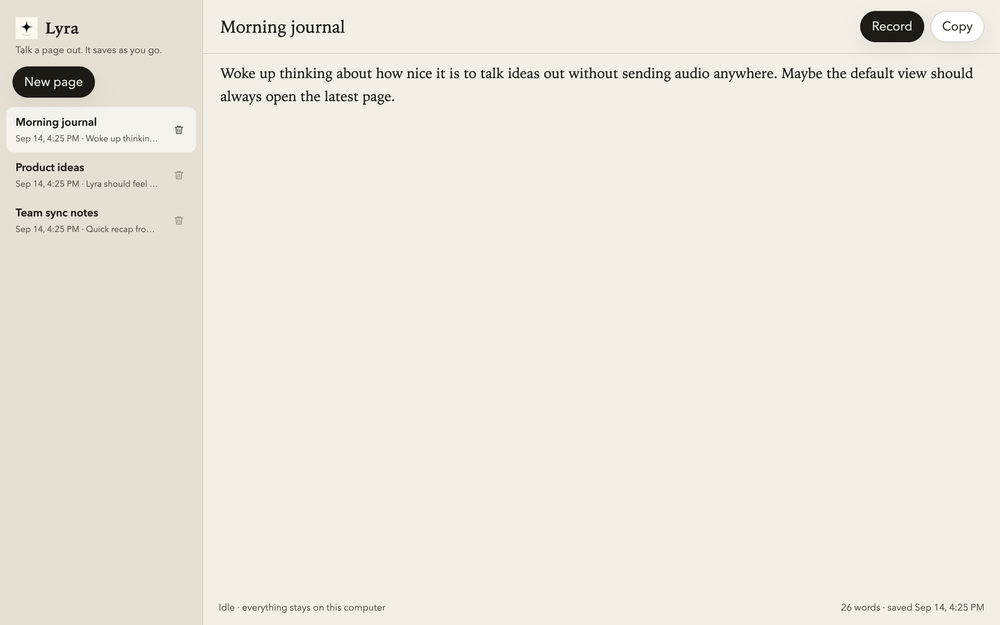

<p align="center">
  
</p>

<h1 align="center">Lyra</h1>

<p align="center">
  <strong>A local voice notebook for desktop.</strong><br />
  Talk onto pages. Edit, copy, autosave — all on your machine.
</p>

<p align="center">
  <a href="LICENSE"></a>
</p>

<p align="center">
  
</p>

## Features

- **Local-first** — audio, transcripts, and pages stay on your device
- **Voice + typing** — dictate as you go, edit anytime
- **Markdown pages** — autosaved to disk in a simple sidebar notebook
- **No cloud** — on-device transcription with [Whisper](https://github.com/ggml-org/whisper.cpp)

## Quick start

**Requirements:** Node.js 20+, pnpm

```bash
git clone https://github.com/adavila0703/Lyra.git
cd Lyra
pnpm install
pnpm dev
```

Grant microphone access when prompted. The first recording downloads the Whisper `base.en` model (~150 MB).

## Build

```bash
pnpm build:mac     # dmg + zip
pnpm build:win     # NSIS installer
pnpm build:linux   # AppImage + deb
```

## Contributing

Issues and PRs are welcome. See [CONTRIBUTING.md](CONTRIBUTING.md). This project follows the [Contributor Covenant](CODE_OF_CONDUCT.md).

## License

[MIT](LICENSE) — Whisper model weights are subject to their upstream terms.
